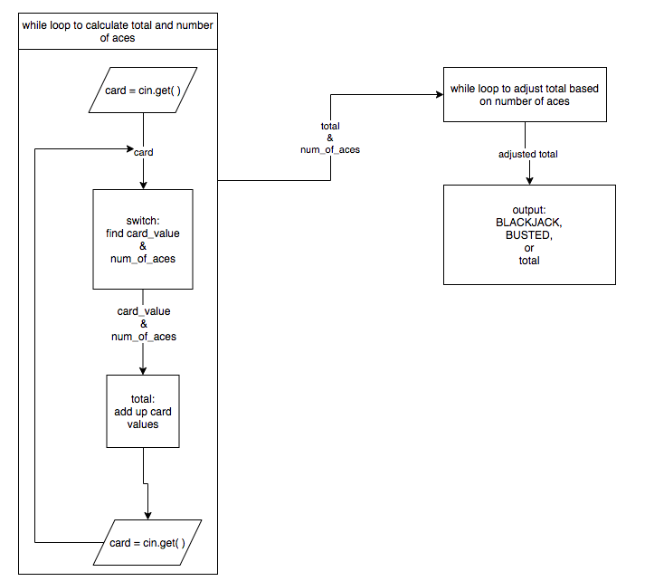

# 03_06_blackjack

- Accept [03_06_blackjack](https://classroom.github.com/a/LpbK60zi)
- Get [main.cpp](main.cpp)

## Description

This program will total a single Blackjack hand and determine when a hand is a winner or a bust. The user will input as many as five cards, ending the input by pressing the enter key. (see cin.get loop)

## Three Blocks

The program is composed of three main blocks within a repeat loop.

- The first block is a while loop that takes the user's input using a cin.get loop and adds up the card values of each card. This block will produce two values: the total (the sum of all the card values) and the number of aces.
- The second block takes the information produced by the first block (`total`, `num_of_aces`) and figures out which of the aces are to be counted as ones and which are to be counted as elevens. The result of this block is the adjusted value of this blackjack hand.
- The third block takes the value of the hand and decides if the hand is a win or a bust. 

## Notes

- Validate Input: The card types can either range from 2-9 or be ‘j’, ‘q’, ‘k’, ‘a’, or ‘t’ for the number 10. The program should consider capitalized versions of these characters to be valid as well.
- Cards (characters) must be converted to `card_values` (integer) See character math.
- Add up the card values and keep track of aces.
- Determine whether an ace should be added as a 1 or a 11 based on whether a bust is likely.

